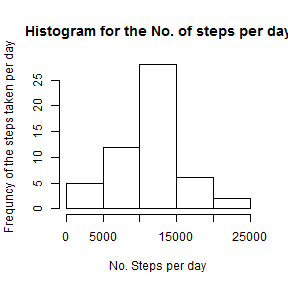
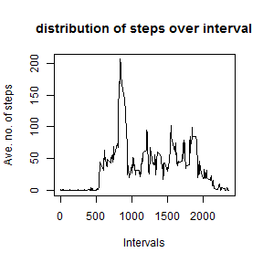
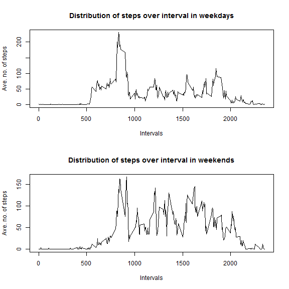

---
title: 'Reproducible Research: Peer Assessment 1'
output:
  html_document:
    keep_md: yes
  pdf_document: default
  word_document: default
---
## Loading and preprocessing the data

```r
df<-read.csv("activity.csv",header=T)
```

## What is mean total number of steps taken per day?
Histogram for the total no. of steps taken per day is

```r
df_hist<-aggregate(df$steps,by=list(df$date),sum)
colnames(df_hist)<-c("date","cnt")
hist(df_hist$cnt,xlab="No. Steps per day",ylab="Frequncy of the steps taken per day",main="Histogram for the No. of steps per day")
```


Median for the total no. of steps taken per day is

```r
median(df_hist$cnt,na.rm=T)
```

```
## [1] 10765
```
Mean for the total no. of steps taken per day is

```r
mean(df_hist$cnt,na.rm=T)
```

```
## [1] 10766.19
```
## What is the average daily activity pattern?

Data set for the average no. of steps taken in every 5 minute interval over all the days

```r
df_step_average<-aggregate(df$steps,by=list(df$interval),mean,na.rm=T)
colnames(df_step_average)<-c("Interval","Ave_steps")
head(df_step_average)
```

```
##   Interval Ave_steps
## 1        0 1.7169811
## 2        5 0.3396226
## 3       10 0.1320755
## 4       15 0.1509434
## 5       20 0.0754717
## 6       25 2.0943396
```
Plot for the distribution of average no. of steps over the intervals

```r
plot(x=df_step_average$Interval,y=df_step_average$Ave_steps,xlab="Intervals",ylab="Ave. no. of steps",main="distribution of steps over interval",type="l")
```



The interval which is having maximum average no. of steps

```r
df_step_average[df_step_average$Ave_steps==max(df_step_average$Ave_steps),]
```

```
##     Interval Ave_steps
## 104      835  206.1698
```
## Imputing missing values
Total no. of missing values

```r
table(is.na(df))
```

```
## 
## FALSE  TRUE 
## 50400  2304
```

Imputing the missing values , 
missing values taken as the mean values for each interval over all the days


```r
for(i in 1:nrow(df))
{
  if(is.na(df[i,1]))
  {
    df[i,1]<-df_step_average[(df_step_average$Interval==df[i,3]),2]
                             ##df_step_average$Ave_steps]
  }
}
```


## Are there differences in activity patterns between weekdays and weekends?
Adding column for specifying weekdays/weekend for any date


```r
df$daytype=weekdays(as.Date(df$date,"%Y-%m-%d"))
head(df)
```

```
##       steps       date interval daytype
## 1 1.7169811 2012-10-01        0  Monday
## 2 0.3396226 2012-10-01        5  Monday
## 3 0.1320755 2012-10-01       10  Monday
## 4 0.1509434 2012-10-01       15  Monday
## 5 0.0754717 2012-10-01       20  Monday
## 6 2.0943396 2012-10-01       25  Monday
```


##Creating the subsets for the weekdays and weekends


```r
df_weekday<-subset(df,!(daytype %in% c("Saturday","Sunday")))
df_average_weekday<-aggregate(df_weekday$steps,by=list(df_weekday$interval),mean,na.rm=T)
colnames(df_average_weekday)<-c("Interval","Ave_steps")
head(df_average_weekday)
```

```
##   Interval  Ave_steps
## 1        0 2.25115304
## 2        5 0.44528302
## 3       10 0.17316562
## 4       15 0.19790356
## 5       20 0.09895178
## 6       25 1.59035639
```

```r
df_weekend<-subset(df,(daytype %in% c("Saturday","Sunday")))
df_average_weekend<-aggregate(df_weekend$steps,by=list(df_weekend$interval),mean,na.rm=T)
colnames(df_average_weekend)<-c("Interval","Ave_steps")
head(df_average_weekend)
```

```
##   Interval   Ave_steps
## 1        0 0.214622642
## 2        5 0.042452830
## 3       10 0.016509434
## 4       15 0.018867925
## 5       20 0.009433962
## 6       25 3.511792453
```
##Plot for the distribution of average no. of steps over the intervals

```r
par(mfrow=c(2,1))
plot(x=df_average_weekday$Interval,y=df_average_weekday$Ave_steps,xlab="Intervals",ylab="Ave. no. of steps",main="Distribution of steps over interval in weekdays",type="l")

plot(x=df_average_weekend$Interval,y=df_average_weekend$Ave_steps,xlab="Intervals",ylab="Ave. no. of steps",main="Distribution of steps over interval in weekends",type="l")
```


